# PyMMC
 Python package to handle MMC data for course 2022/2023

## Scope of the Package
Dear Student of MMC practical 2022/2023, as you TA, I highly encourge (read as: require you) to use Python to clean up, analyse and plot the data you have gathered for the Raman experiment of this course. However, it would be too time consuming for all of you to write your own scripts, and it would take away your focus from the core concepts of the course. After all this is a macromolecular chemistry course not an introduction to Python one. Therefore, I wrote you a neat little package that you can use to read the data in CSV files read from the experiments and perform data processing (baselining, normalisation, noise reduction and cosmic removal), data analysis (integrals and center of mass) and data plotting (single spectra, spectra over time, integral over time). This way when I read your reports what you will get judged on is your scientific, critical analysis, and writing skills (or lack thereof) and not your ability to use Excel.

You are of course allowed to not use this package and write your own, modify it or do anything else with it (open source with MIT licence). For data processing/analysis you can, if you prefer use Spectragryph on the UPV. However, screenshots of your UPV will not help your grades, so take care that the plots you present look good and make sense. 
My legal team has notified me that I technically cannot force you to use python, here's a few alternatives that are also accepted: Matlab, Javascript, Julia, C++(good luck with this one) or whitespace. Excel is also allowed(not recommended) but please take care that your plots don't look disgusting and actually provide all the information needed. 

**_For questions and debugging issues (with limitations) I'm available at e.savino@rug.nl_**

## System Reqirements
For this package no environment nor python executable is provided, You are responsible to have Python 3 on your machine and a way to manage your packages. I recommend the combination of Pip and Conda for your package and environment management. If you don't know how to do any of this, read the Python documentation, If you don't know what python is, start from the definition of a computer and work your way forward.

Required packages:
- Matplotlib
- Numpy
- Pandas
- Scipy  
- sif_parser (this you can download with pip install sif_parser), all rights reserved to https://github.com/fujiisoup

## Documentation
This documentation not only provides instructions on how to use this package effectively, but also offers guidance on handling Raman data in a best(at the best of my knowledge) practice manner.

#RAMAN SPECTROSCOPY
### Importing the package 
Ensure that you have the Ramacrompy folder in your working directory and add the following code to your script:
```python
from Ramacropy.Ramacropy import RamanSpectra as Spectra
```
Do not make changes to the code within the folder, as doing so may cause issues with its functionality. Instead, simply import and use the package in your own script.


### Loading data
If you have data in a sif file from the lab, place it in your working directory (or in a subdirectory). You can load it into Python using the following code:
```python
my_spec = Spectra('Path/to/file.sif', laser_wavelength=785.0)
```
This script is capable of reading sif files from Andor spectrometers, as well as .pkl and .csv files generated only from this script (though this may change if we find that the lab provides csv files). The laser_wavelength parameter defaults to 785 nm (as that's what we use in the lab), so only change it if a different laser was used.

### Data Strucuture
once instantiated you can access the following:
- my_spec.RamanShift -> the x axis of your data, contains the shift at each y point
- my_spec.TimeStamp -> the time data of each spectrum in the series
- my_spec.SpectralData -> the actual y data of your file
- my_spec.RawData -> the same as spectral data, but doesn't change if you perform processing (only .pkl and .sif)
- my_spec.SpectralInfo -> this is the metadata from andor see sif_parser for more info (only .pkl and .sif)
- my_spec.directory -> original path to file
- my_spec.filelab -> original file name

you don't need to do this, but you may want to. 
### Exploratory Plotting
Once the data is loaded, you should plot it to see what you are working with. you can do this in two ways, depending if your data is a kinetic series or a single spectrum.

for kinetic series use:
```python
my_spec.plot_kinetic()
```

you will get the follwing:
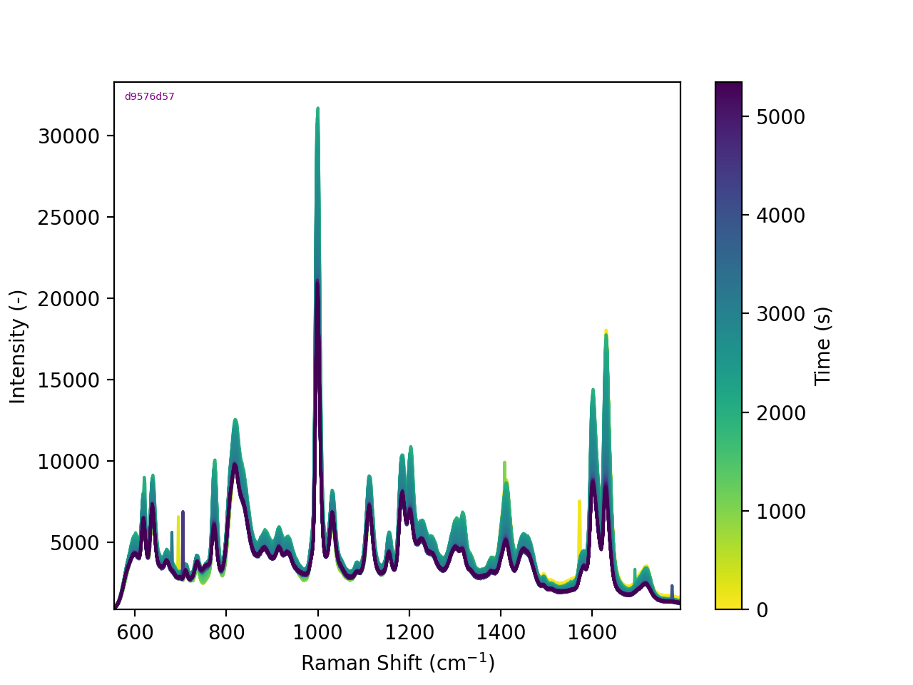

for single spectra use: 

```python
my_spec.plot_few()
```

which yields: 
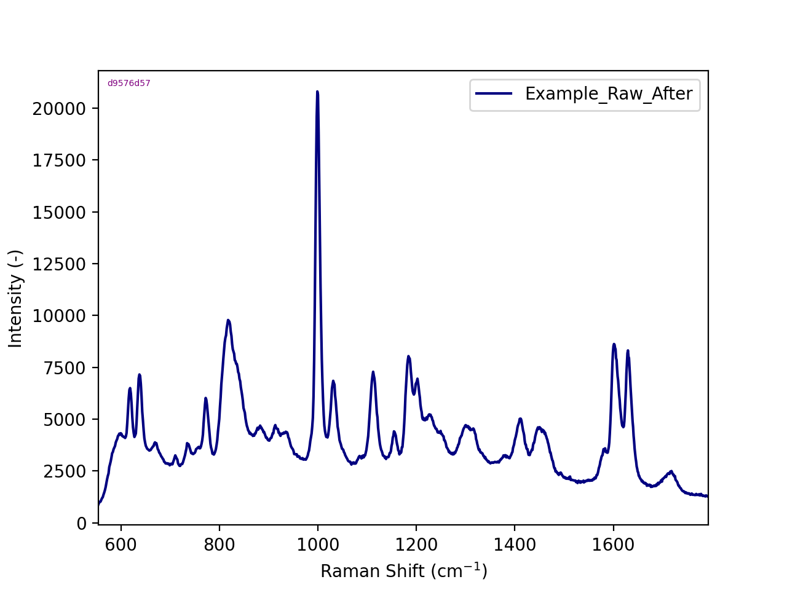

of course you can 

### Data Processing
In data processing, often, less is more. So the tools you have at your disposal are baseline correction, integration (by peak or by area) and spike removal. In order you should first do baseline correction, then normalisation and maybe (only if you really have a lot of spikes) spike removal. 

#### Baseline correction
The baseline correction has takes three parameters, coarsness, angle and offset. the first is an indication of how straight your baseline is, angle is what is the angle of the baseline, and offset is how far up or down do you need the baseline. If you don't know (and i sugeest you do this every time you have a new piece of data) you can run the baseline routine interactively

if you know what parameters you need:

```python
my_spec.baseline(coarsness=0.3, angle = 12, offset = 300)
```

if you don't know you can use:

```python
my_spec.baseline(interactive = True)
```
and you'll get the following interactive plot:
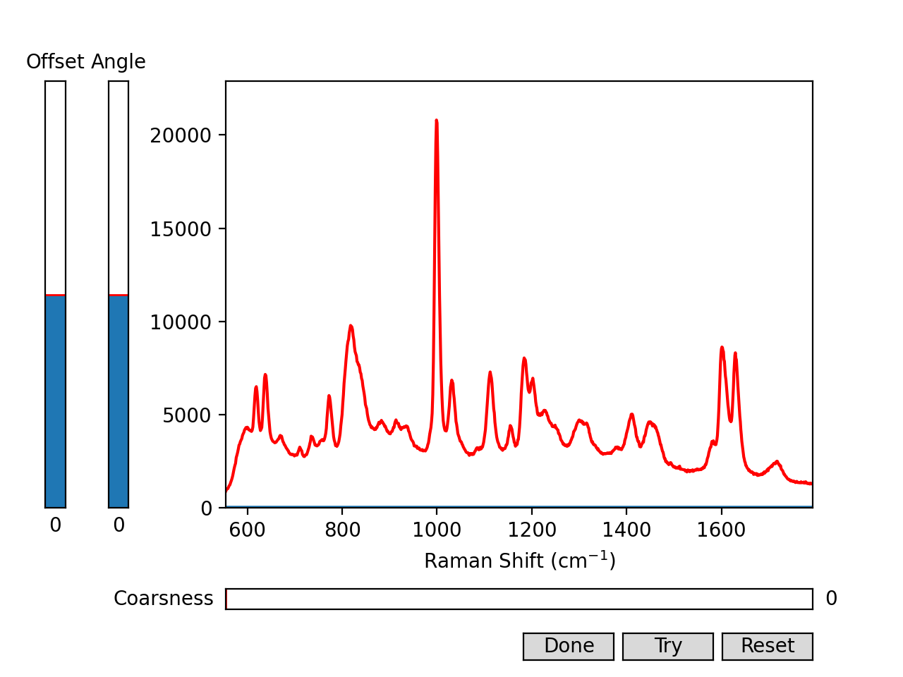

adjust the sliders until you get a baseline that looks satisfactory, like so:
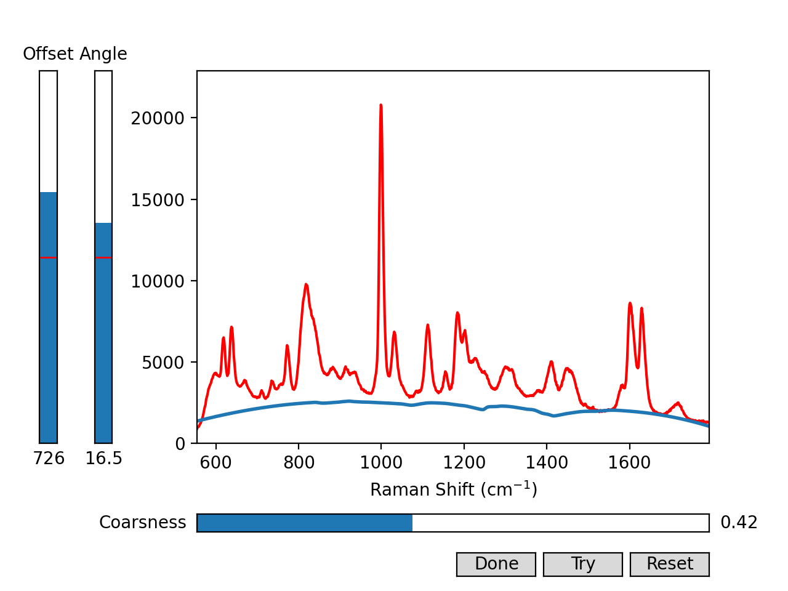

To apply the baseline correction to your spectra, click the 'Try' button. If you want to start over, click the 'Reset' button. Once you're satisfied with the correction, click the 'Done' button to confirm.

#### Normalisation
The normalisation method is similar to the baseline, you first have to decide which method to use, either 'area' or 'peak'. The choiche is yours. Again it is possible to run this interactively if you're not sure where to put your bounds/peak. 
if you decide against the interactive method you cand do so as follows:
for area:
```python
my_spec.normalise(method='area',start=700.0,end = 750.0)
```
where start and end are the bounds of your normalisation in Raman shift (cm<sup>-1</sup>)
for peak:
```python
my_spec.normalise(method='peak',peak=700.0)
```
if you decide to run interactively, you can do, for area:
```python
my_spec.normalise(method='area',interactive=True)
```
which will open the following window:
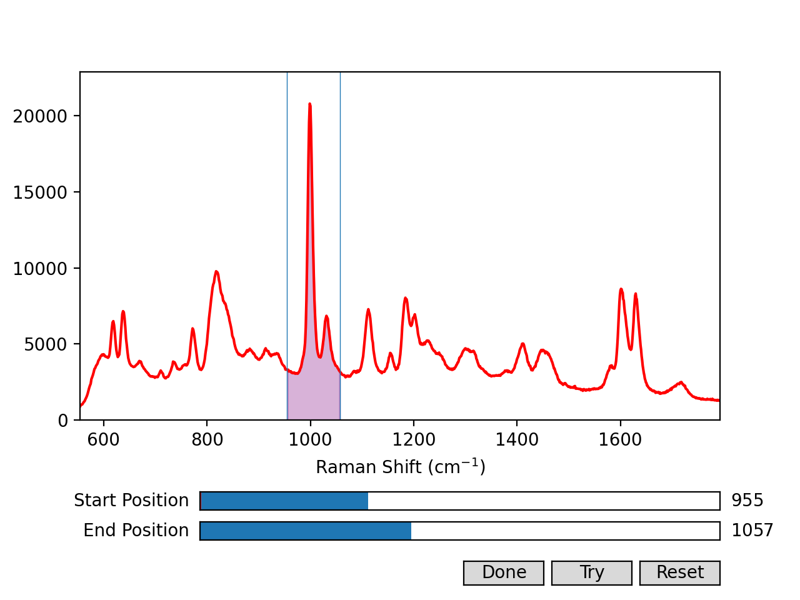

use the sliders to decide your bounds of integration, the buttons do what explained previously.

for interactive peak use:
```python
my_spec.normalise(method='peak',interactive=True)
```
which will open the following:
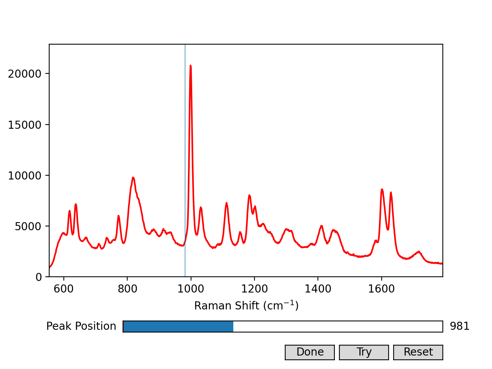

use the slider to choose your peak position, and use the buttons to apply, reset or confirm

#### Spike removal
It can happen that the sensor in the spectrometer picks up random cosmic rays passing through it, this show up in the spectra as "cosmics", or spikes, you can recognise them as they are very thin, only last 1 spectrum, and change without any recognisable pattern.
To attempt at removing them you can use, 
```python
my_spec.spike_removal()
```

if it doesn't remove them all, it's fine. just ignore them, (acknowledge this in your analysis)

### Data saving
Congrats, you have gotten though your data processing, before we discuss how to do data analysis, let's discuss how to save your data. 
you can save the data as a .pkl file, which is a binary file that saves all the information in your data (raw data, processed data, time stamps, spectrometer conditions etc etc) but is not human readable (this is the default) or in a human readable CSV. To do so use:
```python
my_spec.save_changes(dirpath = 'Where/Save', filename = 'NameFile.pkl(or.csv)')
```
dirpath and filename arguments are optional, if the dirpath is missing it will save in the directory where the original file was, and if the filename is missing it will save a .pkl file with the same name as the original file.

BE CAREFUL, THIS WILL OVERWRITE FILES WITHOUT WARNING YOU!!! (you have been warned)

the files generated with this command are can be opened with this program (check above)

### Data analysis
You are provided only one method of data analysis (as i think that for the scope of this course is more than enough), which is integration, you of course are also provided (i hope) your common sense, which is paramount in you understanding what is going on in your spectra!

#### Integration
Integration measures the area of your spectrum within certain bounds. The code works exactly as the normalisation by area, 
you can run it either by passing the bounds of integration, or interactively. 

if you choose to run this interactive:
```python
my_spec.integrate(interactive=True)
```

which will give this window: 
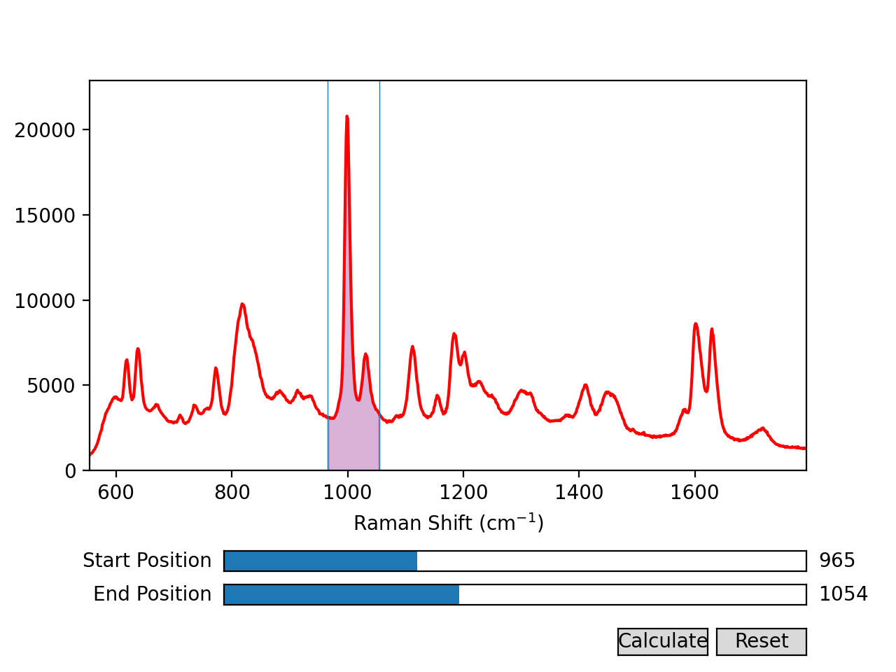

Use the sliders to select the integration area, the calculate button calculates the integral, and the reset button, resets the sliders.

if you already know your integration bounds you can use:
```python
my_spec.integrate(start = 850.0, end = 1000.0)
```
where the start and end are the bounds for the integration.

### Plotting your analysis
Now we get to the fun part. Once you have itegrated and processed your spectra you need to plot them and put them in your report. You are provided with the follwing tools: 
- plotting a kinetic run
- plotting one single spectrum, or a comparison of a few spectra
- plotting the trace of the integral (or conversion) of a kinetic run, or a comparison of kinetic run traces.
- plotting the integral of a single specrum, or a comparison of a few spectra.


#### Kinetic series of spectra
this command we have already seen:
```python
my_spec.plot_kinetic()
```

#### Plot a single spectrum, or a comparison

you can plot a single specrum with:
```python
my_spec.plot_few(labels=['my_label'])
```
the labels argument is a list of the labels you want the legend of the spectra to display. If you omit it, it will default to the filename

now imagine you have instantiated the follwing:
```python
before_spectrum = Spectra('Data/Processed_Before.pkl')
after_spectrum = Spectra('Data/Processed_After.csv')
```
the Spectra must have been integrated already (with spec.integrate)

you can plot them toghether with:
```python
before_spectrum.plot_few(other_spectra=[after_spectrum],labels = ['Before','After'])
```
and you'll get something like this:
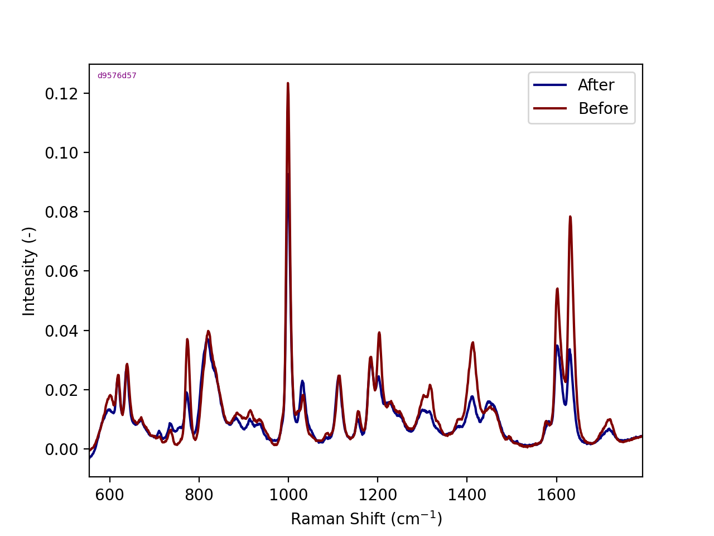

From here you can discuss what happens in your spectra. (of course you can zoom on a part in matplotlib. Weird cutouts from the jpeg will not be accepted. Keep it neat)

#### Plot a kinetic trace or a comparison
To plot a trace of the integral over time use:
```python
my_spec.plot_integral_kinetic()
```
or 

```python
my_spec.plot_integral_kinetic(conversion=True)
```

to get: 
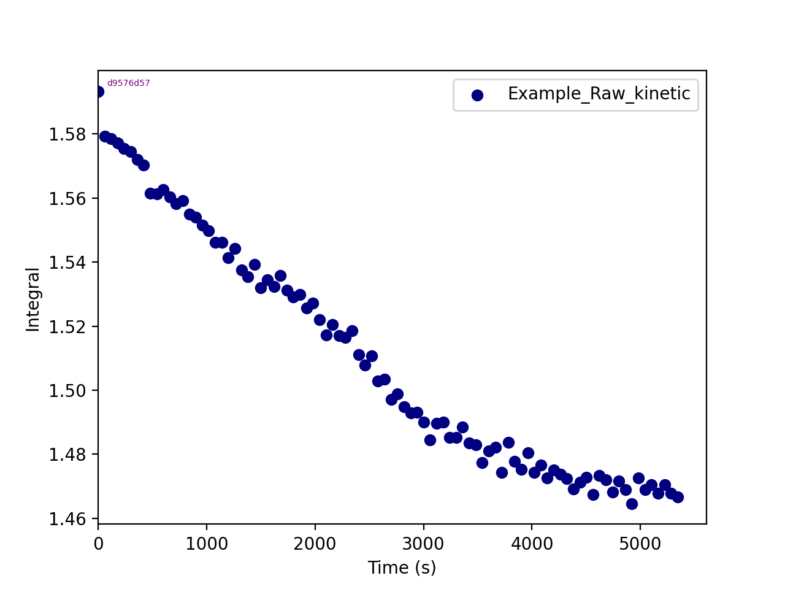

or 
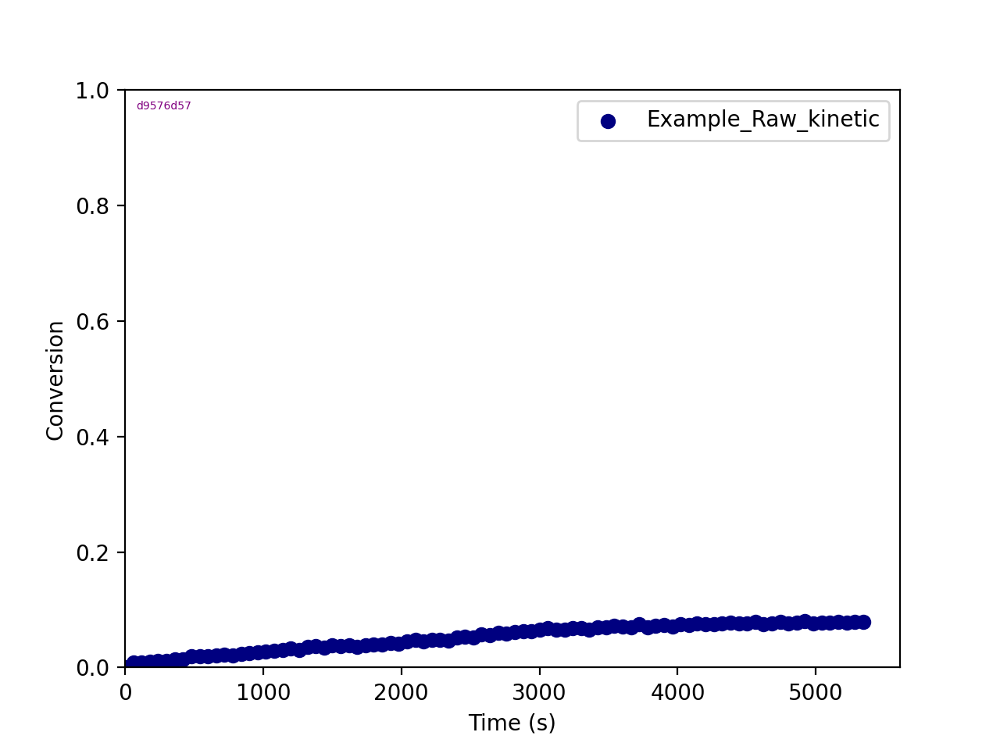


you can use the argument labels = ['mylabel'] as before to change the name in the legend.

now again imagine that you have the follwing sets of data, that has previously been processed and integrated

```python
before_spectrum = Spectra('Data/Processed_Kinetic_B.pkl')
after_spectrum = Spectra('Data/Processed_Kinetic_A.csv')
```

you can plot the two traces toghether with:
```python
before_specrrum.plot_integral_kinetic(other_spectra=[after_spectrum],labels=['Before','After'])
```
yielding: 
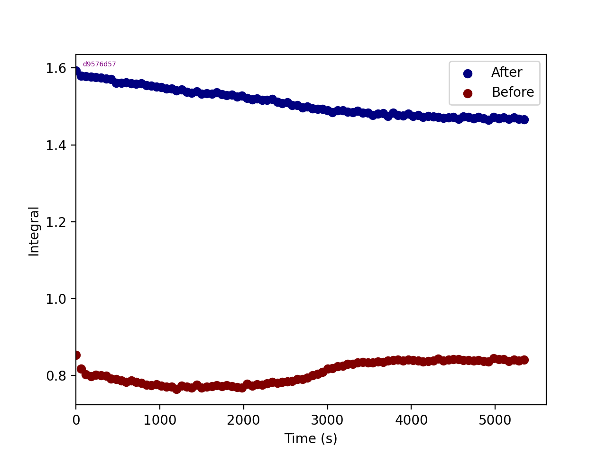

you can use the conversion parameter to show conversion instead

#### plotting the integral or the comparison of integrals 

see the plotting_few spectra, but with plotting_integral_single

you will get this:
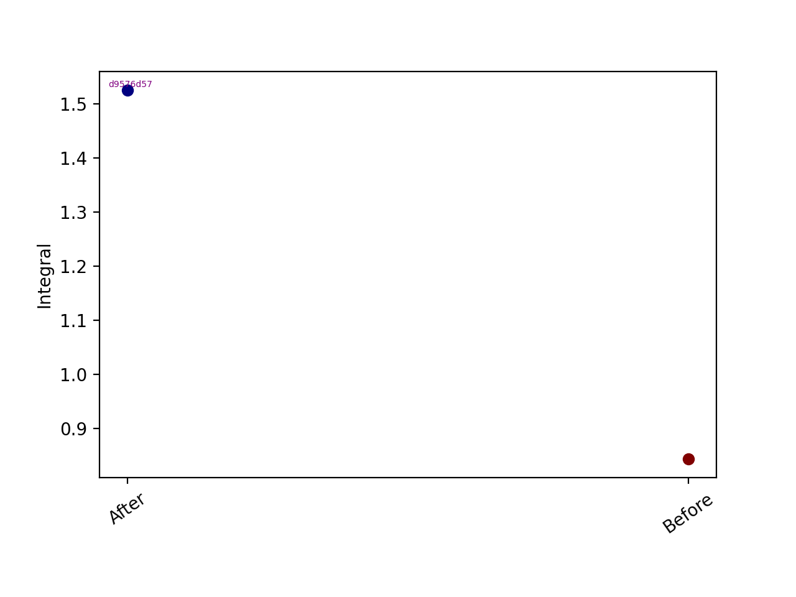


##Final notes
This is the documentation for this. It should not break, but if it does please get in contact with me. Good luck!

there is an example of use in ExampleRaman.py

## IR SPECTROSCOPY 
### Importing the package 
Ensure that you have the Ramacrompy folder in your working directory and add the following code to your script:
```python
from Ramacropy.Ramacropy import IRSpectra as IR
```
Do not make changes to the code within the folder, as doing so may cause issues with its functionality. Instead, simply import and use the package in your own script.

### Loading the data
loading data with the IR class is even easier than with Raman, just use:

```python
My_Ir_spec = IR('Path/To/File.txt')
```

The data supported is wither .txt files from shimadzu IR spectrometer, .csv or .pkl files that are generated by the script itself. If any other data type is necessary, please contact me and it can be added
### Data Plotting
To plot the data you can access the 'plot_few' method of your IR spectrum class, it behaves exactly the same as the 'plot_few' method of the Raman spectra class. It allows to plot multiple spectra together assuming they are all in consistent units (otherwise it throws an error)
### Data Processing
With IR, the array of tools you have to do data processing, for your needs at least, is less broad. Since the units used for IR actually have physical meaning (not like intensity in Raman) more care has to be taken that the changes applied are a good tradeoff between imporving the spectra and loosing information. Thus you are only provided with a baseline and a change of units. Good luck!
#### Changing Units
For IR it is important to be careful about units, a method is provided to change from transmission to absorbance and one for absorbance to transmission. It is important to remember that absorbance is linear with concentration (Beer-Lambert) whereas transmission is logarithmic, thus it is suggested to use absorbance when manipulating or comparing the spectra.

```python
# To change from transmission to absorbance:
my_Ir_spec.t_to_A()
# and vice versa:
my_Ir_spec.A_to_t()
```
The system remembers which units it has, so don't worry it will stop you from doing weird stuff
#### Baseline correction
Baseline correction works identically to the one for Raman spectra (scroll up to check). The data needs to be in absorbance.

```python
my_Ir_spec.baseline(coarsness=0.2,angle = 0, offset= 0.01)
# or interactively
my_Ir_spec.baseline(interactive = True)
```
### Saving Data
Similarly to Raman spectra it is good practice to save the data often, to do so use:
```python
my_Ir_spec.save_changes(dirpath='Where/To/Save',filename='File_Save.csv')
```

The supported filetypes are .csv and .pkl, similarly to Raman not passing any arguments will save a .pkl file with the same name as the input file in the same directory of the input file. 

IT OVERWRITES WITHOUT WARNING!!!! (YOU HAVE BEEN WARNED AGAIN!)

### Data analysis
For data analysis you are provided with two tools, an integration tool and a pointer (or peak) tool. Similarly to Raman, the integration tool allows to calculate the area under your spectrum in a certain interval. The pointer tool reads the value of your data at a specific wavenumber. 
#### Integral
Integrating your spectrum is done through:
```python
my_Ir_spec.integrate(start = 3000, end = 32000)
```

similarly to the Raman, it can also be run interactively with:
```python
my_Ir_spec.integrate(interactive=True)
```
#### Value at position
Reading a value at position x = something, can be done with:
```python
my_Ir_spec.spec_pos_val(position=2120)
```
or interactively:
```python
my_Ir_spec.spec_pos_val(interactive=True)
```

#### Plotting the values
Of course it is nice to plot these values so you can put them in your report (especially if you're trying to compare the values from more spectra). This can be done through the:
```python
my_Ir_spec.plot_values_single(other_spectra=[my_Ir_spec2],labels = ['onespec','twospec'], method = 'integral')
```
where:
- other_spectra is an array of other IRSpectra class instances, defaults to empty: these are the other datapoints you want to plot togheter
- labels array of descriptive names
- method can either be 'integral' or 'peak' and it makes sure you're plotting the right data

It is important that all the IRSpectra classes that you are trying to plot have the attribute of integral (if you're plotting integral) or peak (if you're plotting peak), in other words that you have integrated or measured a position on them. 
#### Plotting a calibration curve for starch acetilation
If you have the spectra of 85% acetylated starch and 0% acetylated starch references properly processed, and you have read the peak value at the correct peak position. You can use this function to plot your calibration curve and predict the acetylation of your own sample:
```python
my_Ir_spec.plot_calibration(acetyl_0 = IR_spec_noAcetyl ,acetyl_85 = IR_spec_85Acetyl)
```

